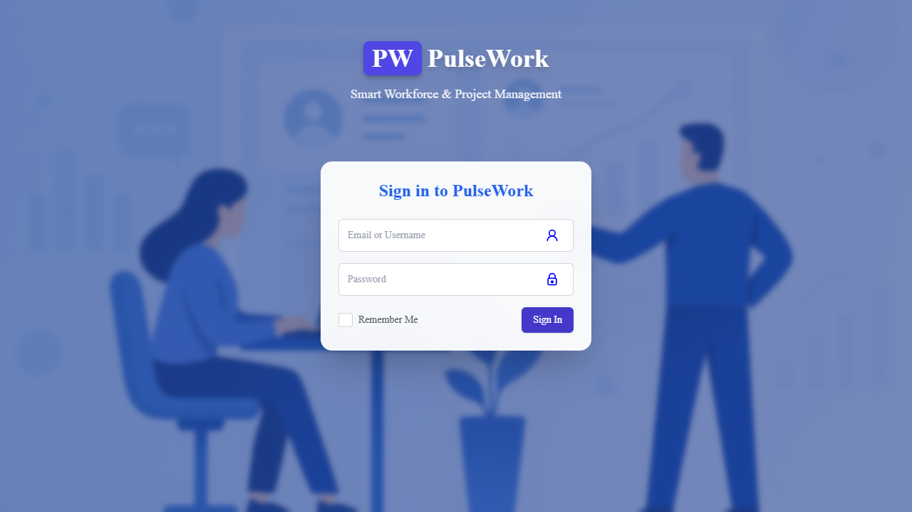
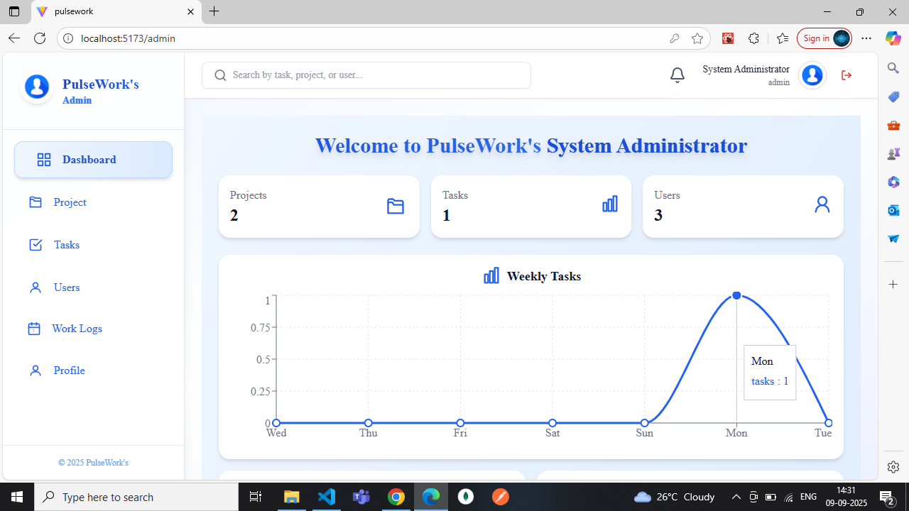
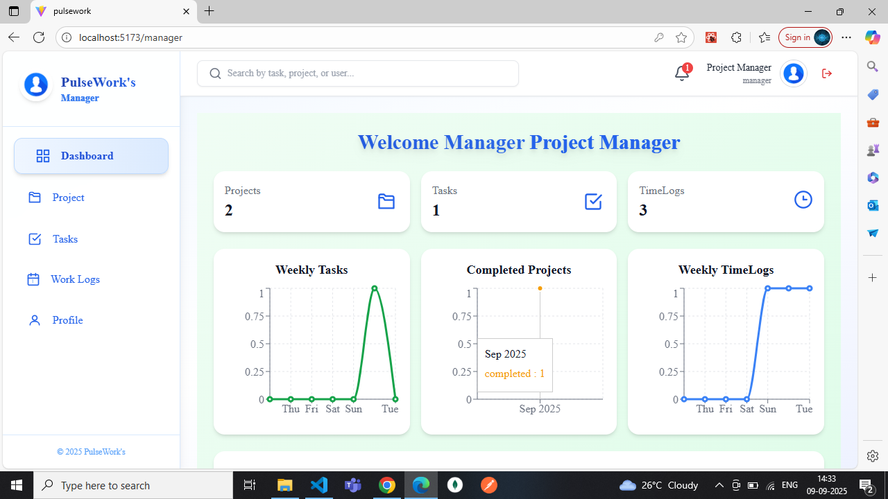
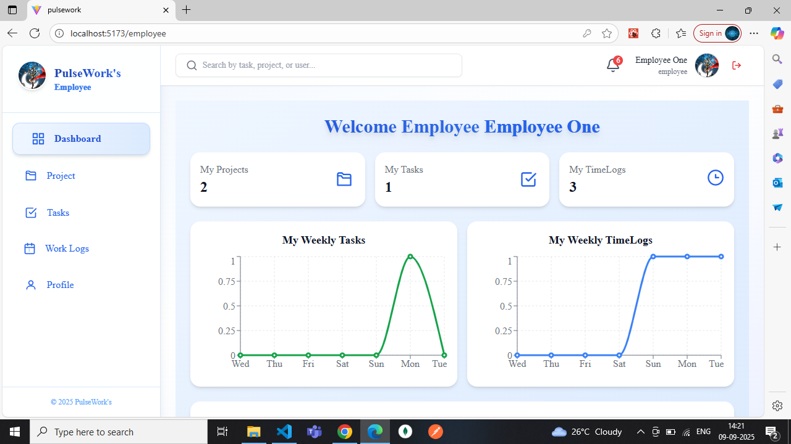
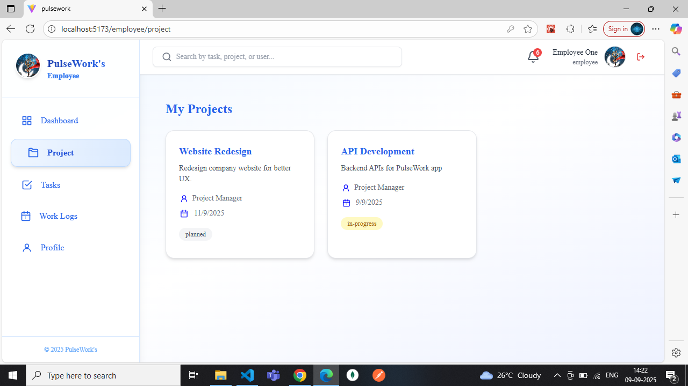
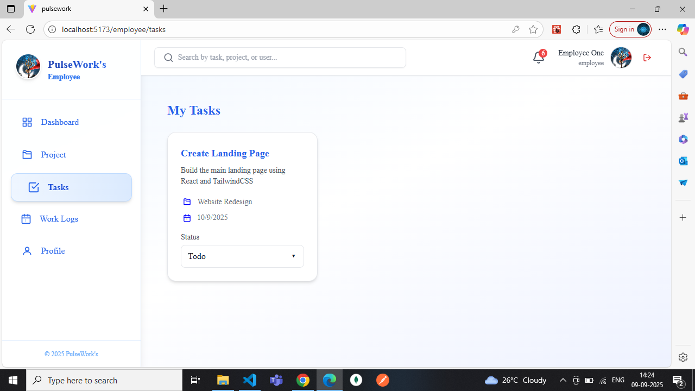
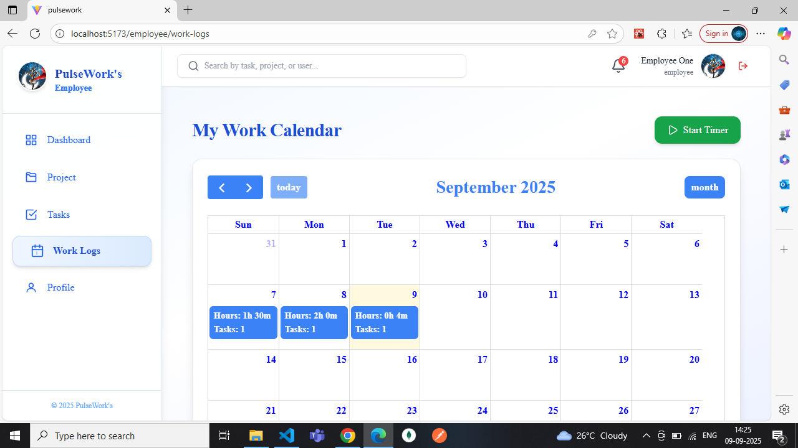
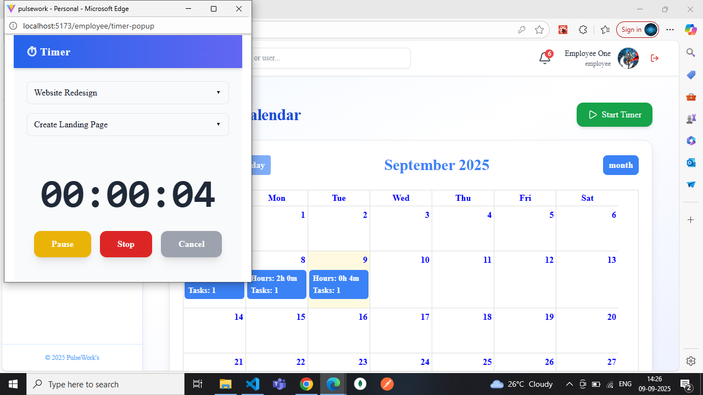
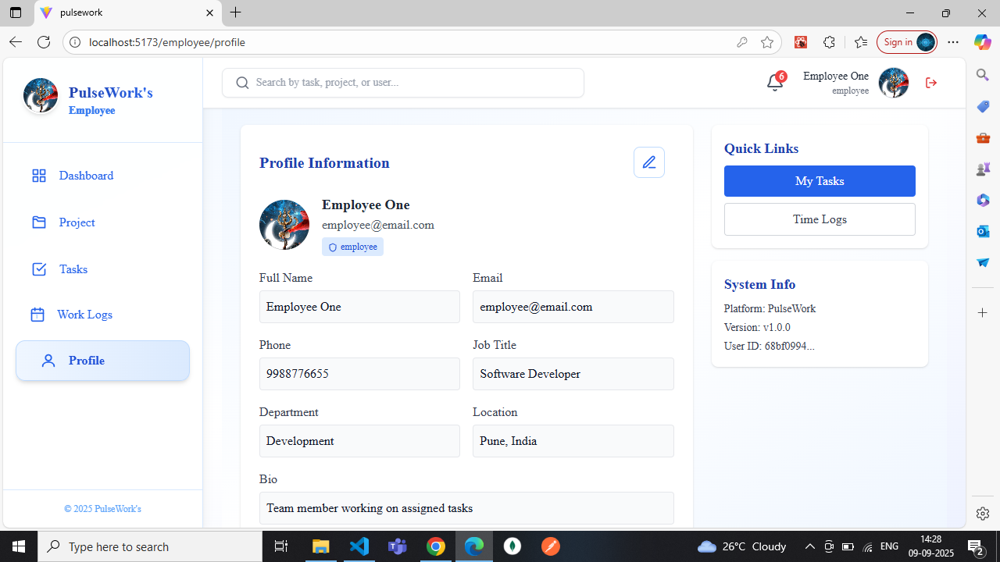

# 🕒 PulseWork

A **Project & Task Management System** with advanced **time tracking** ⏳\
Built using the **MERN Stack (MongoDB, Express, React, Node.js + TypeScript)**, designed for teams to **plan, track, and analyze work efficiently**.

---

## 📂 Project Structure

```
PulseWork/
 ├── backend/        # Node.js + Express + MongoDB APIs
 ├── frontend/       # React + TypeScript + TailwindCSS
 ├── README.md       # Project documentation
 └── .gitignore      # Git ignore file
```

---

## 🚀 Key Features

- 🔐 **Authentication & Authorization** (Admin, Manager, Employee)
- 📊 **Project & Task Management** → create, assign, and monitor tasks
- ⏱️ **Time Tracking** → start, pause, and stop tasks with detailed logs
- 📈 **Reports & Analytics** → track daily, weekly, and monthly hours per team member
- 🎨 **Interactive UI with Animated Icons** → smooth Framer Motion animations for dashboards and components

---

## 🛠️ Tech Stack

| Layer    | Technology                                                          |
| -------- | ------------------------------------------------------------------- |
| Frontend | React, TypeScript, TailwindCSS, Framer Motion (with animated icons) |
| Backend  | Node.js, Express.js, MongoDB, JWT Authentication                    |
| Database | MongoDB (Mongoose ODM)                                              |
| Tools    | GitHub, VS Code, Postman                                            |

---

## ⚡ Getting Started

### 1️⃣ Clone the Repository

```bash
git clone https://github.com/MeetRamani28/pulsework.git
cd pulsework
```

### 2️⃣ Backend Setup

```bash
cd backend
npm install
npm run dev
```

Backend runs on: [http://localhost:4000](http://localhost:4000)

### 3️⃣ Frontend Setup

```bash
cd frontend
npm install
npm run dev
```

Frontend runs on: [http://localhost:5173](http://localhost:5173)

---

## 👨‍💻 User Roles & Permissions

| Role         | Permissions                                 |
| ------------ | ------------------------------------------- |
| **Admin**    | Manage users, projects, tasks               |
| **Manager**  | Create projects, assign tasks, view reports |
| **Employee** | Execute tasks, log working hours            |

---

## 📸 Screenshots

### Login Page



### Admin Dashboard



### Manager Dashboard



### Employee Dashboard



### Employee Project Page



### Employee Tasks Page



### Employee WorkLogs Page



### Employee Timer Popup



### Employee Profile Page



_Note: All dashboard and task icons are animated using Framer Motion._

---

## 📊 Planned Improvements

- 📧 Email & Notification System
- 📱 Fully responsive mobile UI
- 📤 Export Reports (Excel / PDF)
- 🔔 Real-time task updates with WebSockets
- ⚡ Dark Mode toggle

---

## 🤝 Contributing

Contributions, issues, and feature requests are welcome!\
Check the [issues page](https://github.com/MeetRamani28/pulsework/issues).

**Steps to contribute:**

1. Fork the repository
2. Create a feature branch
3. Commit changes
4. Open a Pull Request

---

## 📜 License

Distributed under the MIT License. See `LICENSE` for details.

---

## 🙌 Acknowledgements

- React
- Express
- MongoDB
- TailwindCSS
- Framer Motion (for smooth animations & animated icons)
- Open Source Community

---
